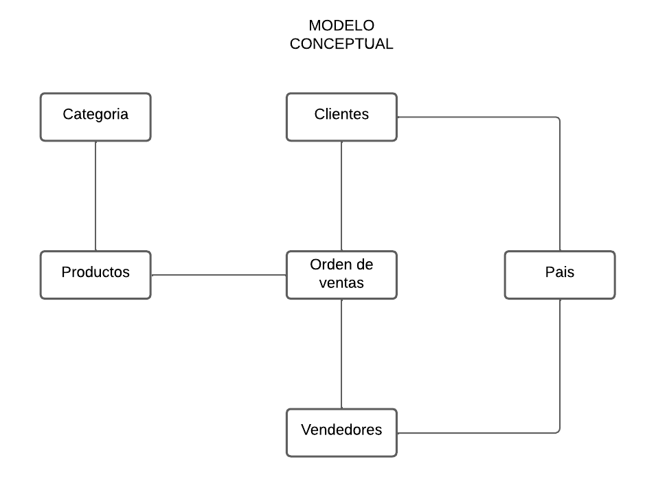
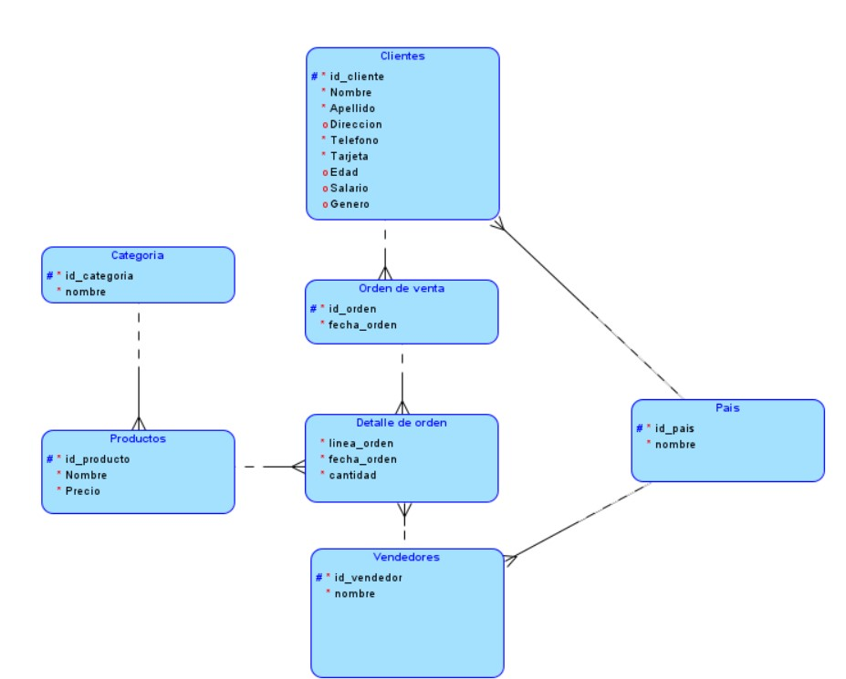
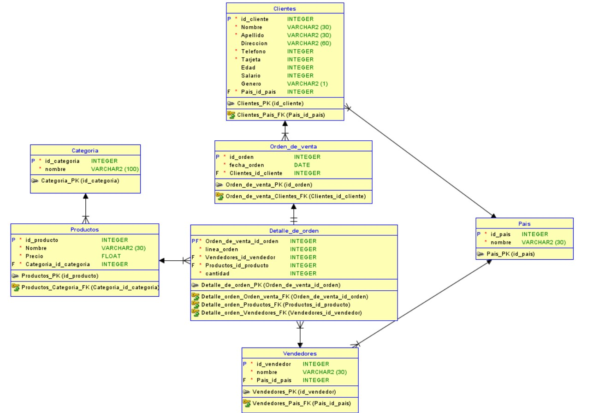

# MANUAL TECNICO - PROYECTO 1

 | Carnet| Nombre Completo 
--- | ---: 
| 202110897 | Lesther Kevin Federico López Miculax 

## MODELOS

### Modelo Conceptual
El modelo coneptual realizado para el proyecto contiene 6 entidades, las cuales son:

- Clientes
- Categoria
- Productos
- Orden de venta
- Pais
- Vendedores

La importancia de este tipo de modelo es poder tener una idea clara de como se relacionaran y manejaran los datos en la base de datos, de este modo, la realizacion de un modelo logico se dificulta menos.




### Modelo lógico

El modelo lógico implementa una estructura diferente al conceptual, de este modo, se puede apreciar cada tabla con sus respecitvos atributos.

- La llave primaria de cada tabla se puede identificar al observar el campo con el simbolo de numeral, de este modo, es posible identificar que la tabla de Productos tiene como llave primaria 'id_producto', de manera similar, la tabla Pais tiene de llave primaria 'id_pais'.
- Los campos obligatorios se identifican con un circulo rellenado color rojo, estos son de caracter fundamental para poder manejas la información de manera adecuada. Un ejemplo de la importancia de estos campos se identifica en la tabla de Pais con su campo nombre, puesto que al tener un registro de esta tabla sin nombre se complica la interpretación de los datos.
- Los campos opcionales no son de caracter fundamental y es información de apoyo para los registros ingresados. Este tipo de campo se visualiza en la tabla clientes con el campo Salario, ya que en algunos casos no es indispensable conocer el salario del cliente




### Modelo Relacional (Diagrama ER)

El modelo relacional proporciona una mejor visualización de lo que seria la implementación de la base de datos, ya que a partir de aqui se puede iniciar con la creación de las tablas y como se van a colocar los campos de cada una. Se especifican las llaves primarias y foraneas para poder comprender como se involucran en otras tablas ciertos campos.



### API (NodeJS)

La api para poder manejar las diversas consultas realizadas en este proyecto se implementó con la tecnologia de NodeJs, para poder inicializar esta api se ejecutan los siguientes comandos:
```Bash
npm init -y
npm install express
```
Express es un framework o plantilla de desarrollo web utilizado en nodejs, el cual proporciona una capa de abstracción sobre el módulo HTTP de Node.js, lo que facilita el manejo de solicitudes y respuestas HTTP, de este modo, esta tecnologia es de gran aporte para poder recibir y tener una respuesta adecuada a las solicitudes

Para ejecutar e iniciar a recibir solicitudes en la API se ejecuta:
```Bash
node <archivojs>.js
```
### SQL Data Modeler

Para poder realizar el modelo logico y relacional se hizo uso del software de oracle denominado como SQL DATA MODELER, esta herramienta de modelado de datos que permite a los desarrolladores de bases de datos diseñar, crear y mantener modelos de datos de alta calidad para bases de datos relacionales y sistemas de gestión de bases de datos.

